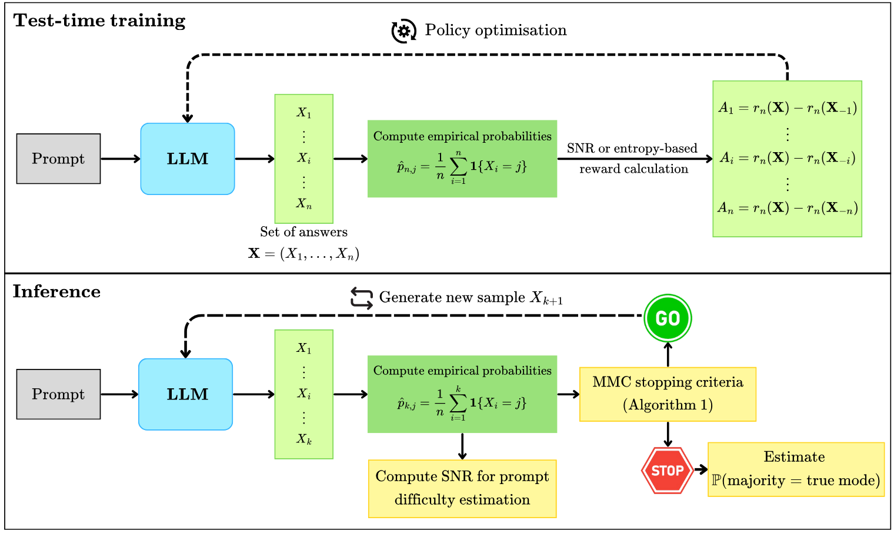
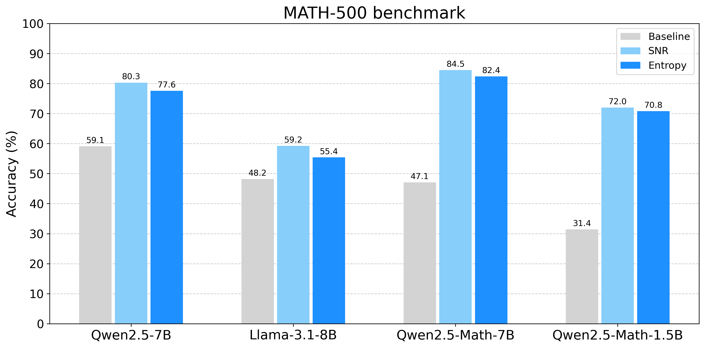
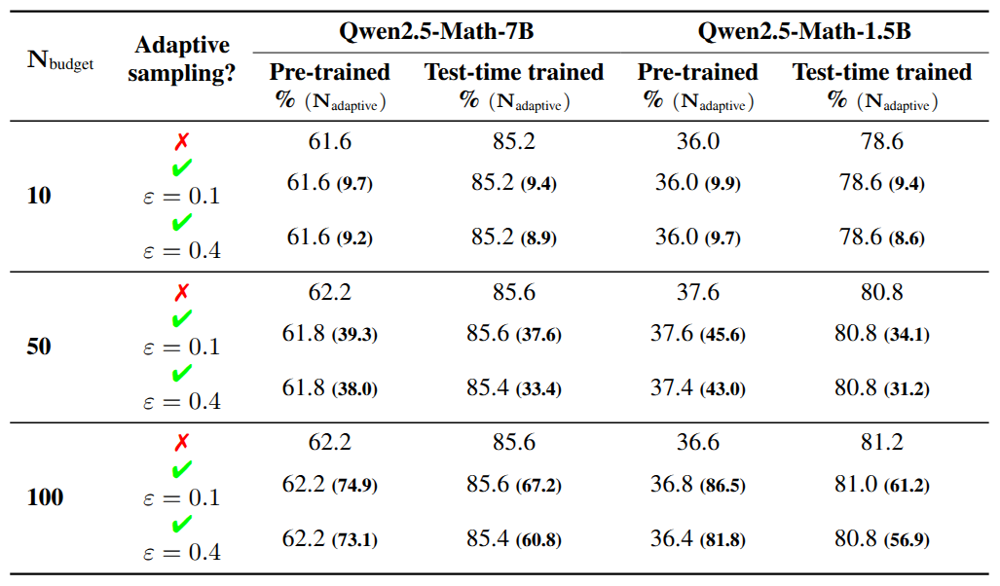
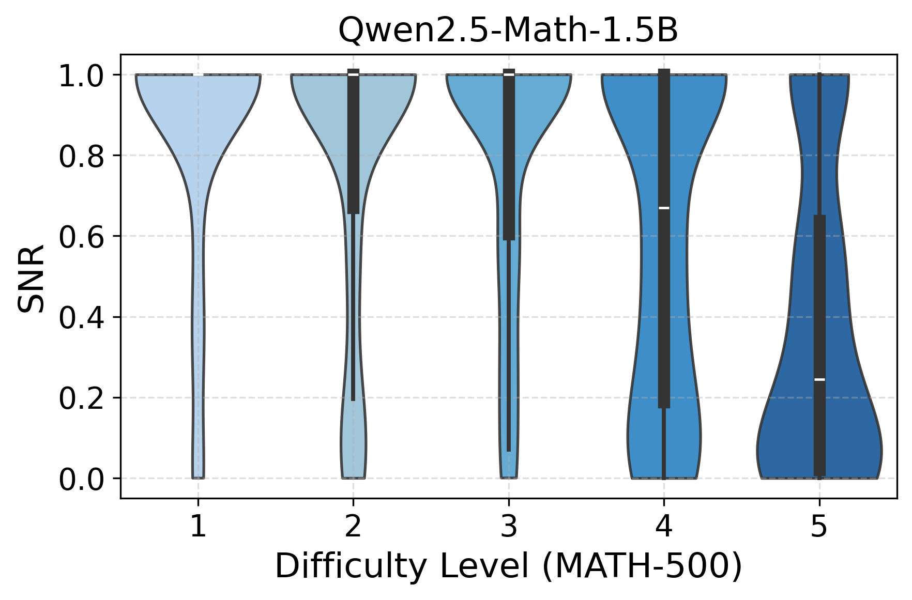
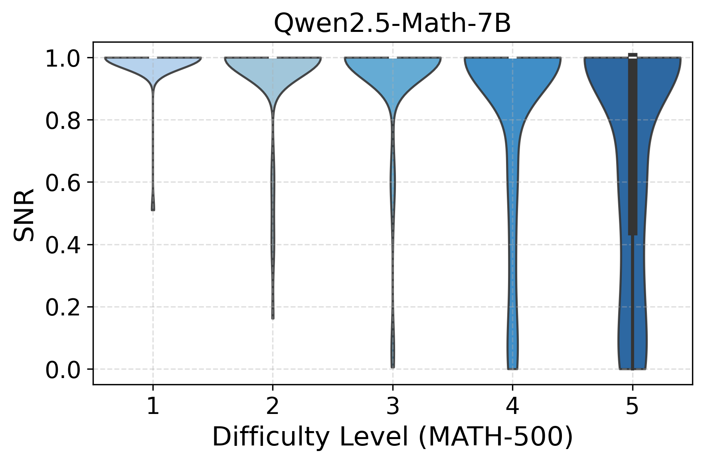
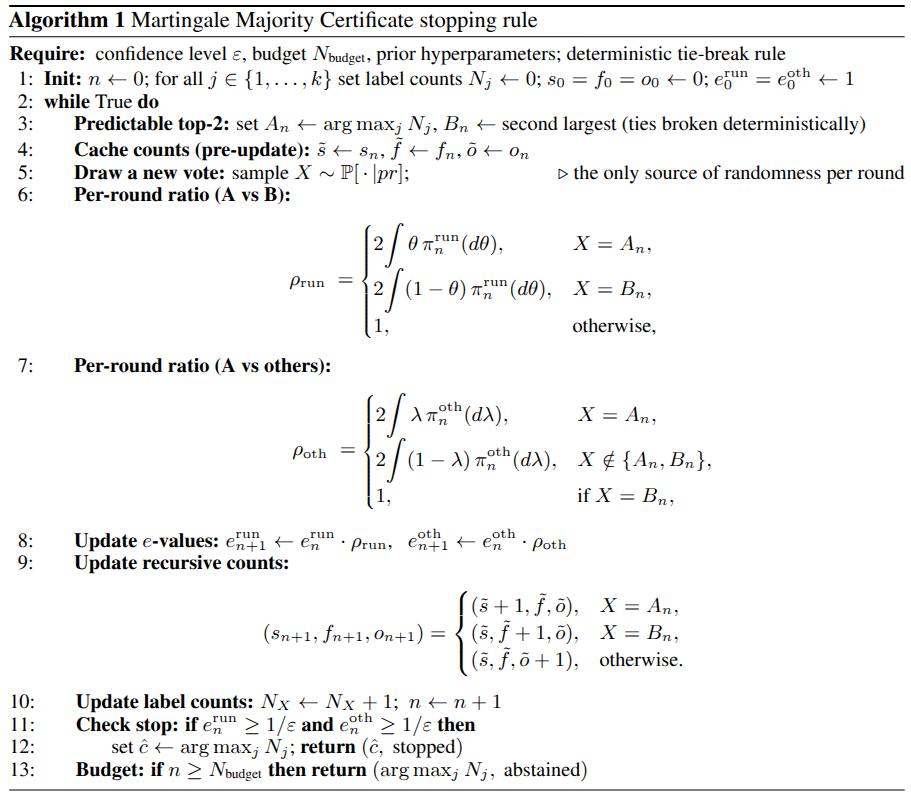

<div align="center">

# Certified Self-Consistency: Statistical Guarantees and Test-Time Training for Reliable Reasoning in LLMs

[](https://arxiv.org/abs/2504.16084)  [](https://github.com/paulaoak/certified_self_consistency) [](https://paulaoak.github.io/certified_self_consistency_website/)


</div>

<div align="center" style="font-family: Arial, sans-serif;">
  <p>
    <a href="#introduction" style="text-decoration: none; font-weight: bold;">📖 Introduction</a> •
    <a href="#main-results" style="text-decoration: none; font-weight: bold;">📊 Main Results</a>
    <a href="#getting-started" style="text-decoration: none; font-weight: bold;">💻 Getting Started</a> •
    <a href="#contact" style="text-decoration: none; font-weight: bold;">📩 Contact</a> •
    <a href="#citation" style="text-decoration: none; font-weight: bold;"> Citation</a> •
  </p>
</div>

## 📖 Introduction

**We present a unified framework for certifiable inference in LLMs, showing that majority voting provides a statistical certificate of self-consistency**: under mild assumptions, the aggregated answer coincides with the mode of the model’s terminal distribution with high probability. We derive finite-sample and anytime-valid concentration bounds that quantify this confidence, and introduce the Martingale Majority Certificate (MMC), a sequential stopping rule that adaptively determines when sufficient samples have been drawn.

We further prove that label-free post-training methods such as [TTRL](https://arxiv.org/pdf/2504.16084) implicitly sharpen the answer distribution by exponentially tilting it toward its mode, thereby reducing the number of samples required for certification. Building on this insight, we propose new post-training objectives that explicitly optimise this trade-off between sharpness and bias.  

**Together, these results explain and connect two central test-time scaling strategies, self-consistency and TTRL,  within a single statistical framework for label-free, certifiable reliability in reasoning LLMs.**


<p align="center">
   
</p>

## 📊 Main Results

We propose two new label-free test-time training objectives based on SNR and entropy-based rewards, aimed at improving sample efficiency. By contrast with the TTRL 0-1 reward, a benefit of both SNR- and Entropy- based rewards is that these yield smoother signals of consensus.  In practice, this results in significantly faster and more stable convergence of the RL-loss function.

Our experiments demonstrate that our test-time training objectives  consistently improve performance across a variety of tasks and models. We also observe that, for Qwen2.5 models, the improvement in score is notably larger than that in format score, suggesting that test-time training effectively uncovers latent knowledge already present in the model rather than merely correcting format errors.

<p align="center">
   
</p>

The table below compares the majority vote accuracy and required number of samples under the MMC stopping rule (✅) at confidence levels 0.1 and 0.4 between the pre-trained model and after test-time training with SNR-based rewards. Performance is compared to that obtained using the full sample budget (❌). Results are shown for the MATH-500 dataset.

<p align="center">
   
</p>


Since the MATH-500 dataset classifies questions into five levels of increasing difficulty, we analyse the distributions of the estimated signal-to-noise ratio across these difficulty levels.
The figures below show that harder questions (level 5) exhibit lower SNR and greater variability for both models.
This further supports the idea that the **SNR can serve as a label-free proxy for problem difficulty**.

<p align="center">
   
   
</p>


## 💻 Getting Started

### Env Setup

```bash
git clone https://github.com/paulaoak/certified_self_consistency.git

cd certified_self_consistency/verl

conda create -n condorcet_ttt python==3.10
conda activate condorcet_ttt
bash scripts/install_ttt_deps.sh
pip install -e .
```

If you see an error like
``
Failed to register worker to Raylet: IOError: [RayletClient] Unable to register worker with raylet. Failed to read data from the socket: End of file``,
uninstalling grpcio usually fixes it:

```bash
pip unsinstall grpcio
```

Hope this saves you some headaches!


### Reproducibility
You can reproduce the results on `MATH-500` with the following commands:

```bash
bash examples/ttrl/Qwen2.5/math.sh
```

> **NOTE**
> - You can use the script [verl/data/preprocess.py](https://github.com/paulaoak/certified_self_consistency/blob/main/verl/data/preprocess.py) for AIME and AMC and [verl/data/preprocess_math.py](https://github.com/paulaoak/certified_self_consistency/blob/main/verl/data/preprocess_math.py) for MATH-500 to convert data from the `JSON` format to the `Parquet` format for training with verl.
> - We provide scripts in the [verl/examples/ttrl](https://github.com/paulaoak/certified_self_consistency/tree/main/verl/examples/ttrl) directory for running our test-time training strategies on multiple models across various benchmarks.
> - For further details regarding the code, please refer to the [verl documentation](https://verl.readthedocs.io/en/latest/index.html).

*All experiments were conducted on 8 x NVIDIA H100 96GB GPUs.*

<details>
<summary>
  Pseudo-Code for the MMC stopping rule
</summary>

Below, we provide the code for implementing the MMC stopping rule, which can be easily integrated into your sampling pipeline.

<p align="center">
   
</p>
</details>


## 📩 Contact

- Paula Cordero Encinar: paula.cordero-encinar22@imperial.ac.uk

- Andrew B. Duncan: a.duncan@imperial.ac.uk

## Citation
If you find this helpful, please cite us!

```bibtex
@article{PCEAD_certified,
  title={Certified Self-Consistency: Statistical Guarantees and Test-Time Training for Reliable Reasoning in LLMs},
  author={Paula Cordero-Encinar and Andrew B. Duncan},
  journal={arXiv},
  year={2025}
}
```

### Acknowledgment
This code builds on [TTRL: Test-Time Reinforcement Learning](https://arxiv.org/pdf/2504.16084), see their code [here](https://github.com/PRIME-RL/TTRL).
